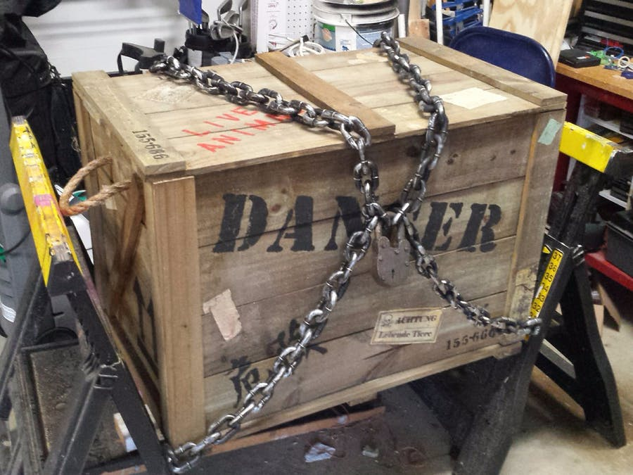
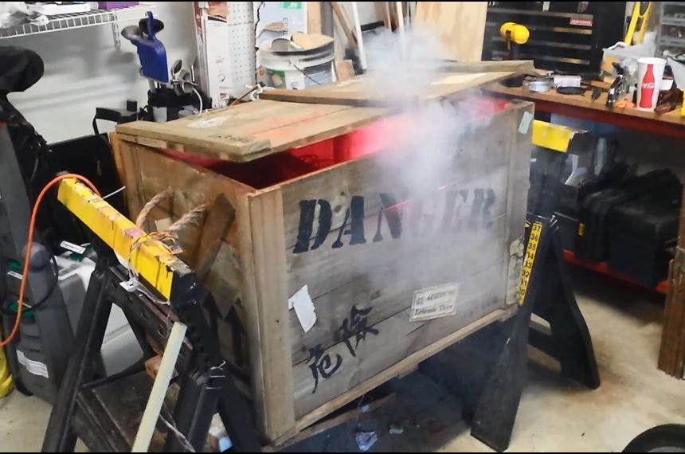
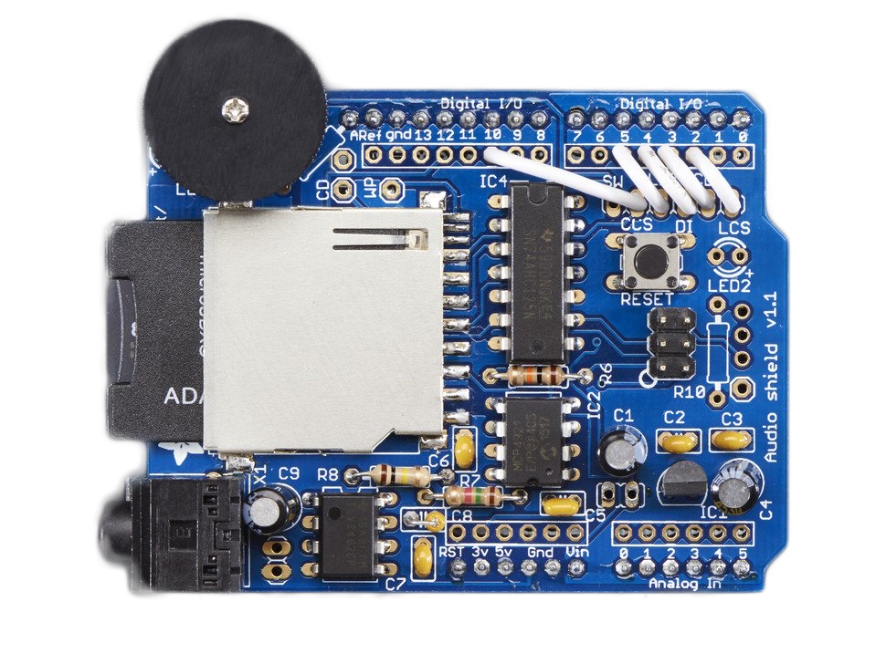

# Monster In A Box
Arduino based controller for a Monster In A Box Halloween prop.

The idea is pretty simple: create the illusion that some type of container is holding a dangerous monster that is on the verge of escaping. The illusion can be created with any combination of motion, sound, light, smoke and, of course, surprise.

Full Build Instructions are Here:
https://www.hackster.io/craig-jameson/monster-in-a-box-41cc38

 

### Wiring Diagram

 

### This project depends on the use of an Adafruit Wave Shield
https://learn.adafruit.com/adafruit-wave-shield-audio-shield-for-arduino/overview

 
